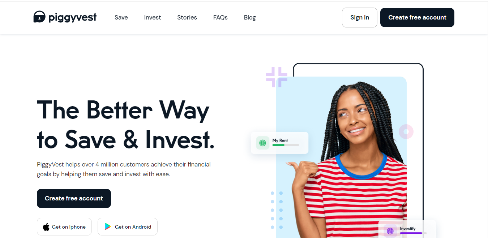
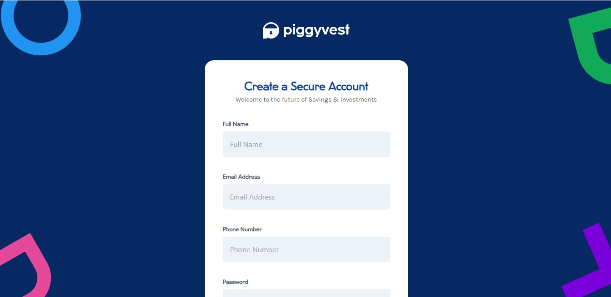
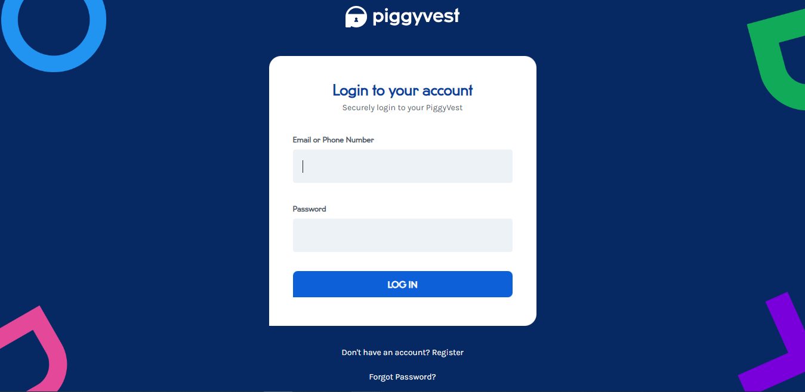
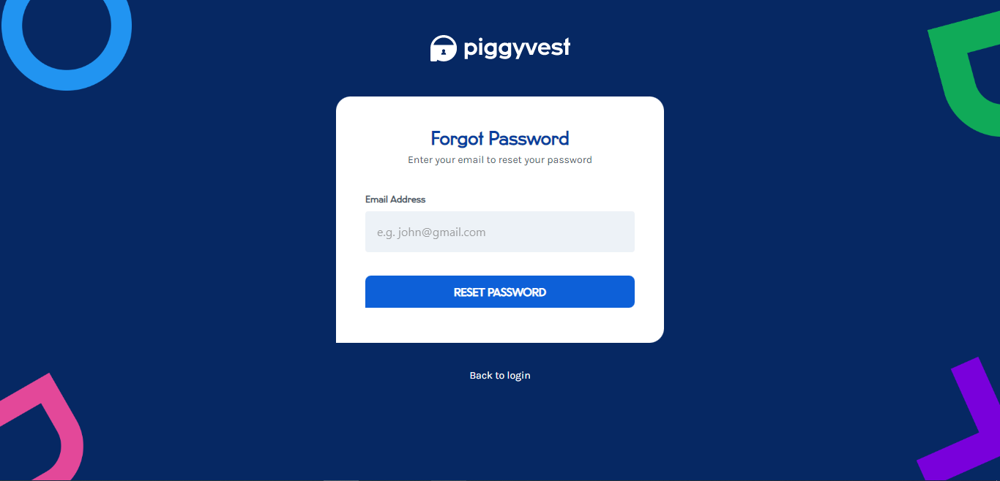

# Piggyvest Clone

PiggyVest helps over 4 million customers achieve their financial goals by helping them save and invest with ease.

We found the web app exciting and decided to make a clone of it. We created five(5) pages in all: 
* The Landing Page 
* The Register page 
* The Login Page and
* The Forgot Password Page 

You can read about our experience [here](https://stammy.hashnode.dev/piggyvest-clone)

## :page_facing_up: Table of contents

- [Piggyvest Clone](#piggyvest-clone)
  - [:page\_facing\_up: Table of contents](#page_facing_up-table-of-contents)
  - [:camera: Screenshots](#camera-screenshots)
  - [:signal\_strength: Technologies](#signal_strength-technologies)
  - [:cool: Live-Solution](#cool-live-solution)
  - [:envelope: Contact](#envelope-contact)
  - [:pen: Contributors](#pen-contributors)

## :camera: Screenshots

## :signal_strength: Technologies

* [ReactJS](https://reactjs.org/) 
* [CSS](https://developer.mozilla.org/en-US/docs/Web/CSS) for styling.
* [Javascript](https://www.javascript.com/) for adding functionalities and making it interactive.
* [Vercel](https://www.vercel.co/) for hosting the project.

## :cool: Live-Solution

* Here is the [link](https://piggyvest.com/) to the original site.
* Here is the [link](https://piggyest.vercel.app/) to the clone.

## :envelope: Contact

* Repo created by [Moyinoluwa](https://github.com/moyinoluwa-10/), email: moyinadelowo@gmail.com

## :pen: Contributors

* [Moyinoluwa](https://github.com/moyinoluwa-10/)
* [Stephen](https://github.com/stephen-gift/)
* [Amos](https://github.com/dukeamos-09/)

